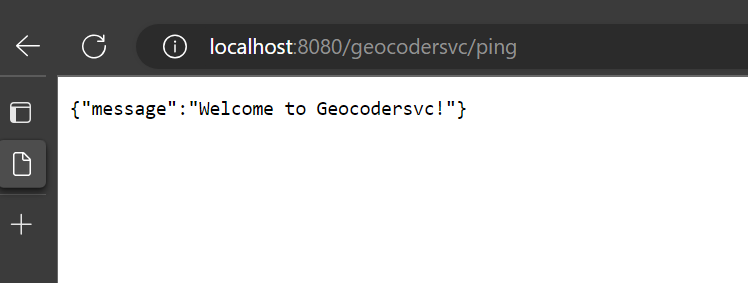

<br/>
<p align="center">
  <h3 align="center">Geocoder Service</h3>

  <p align="center">
    Integration Service for querying Address in Data BC.
    <br/>
    <a href="https://github.com/bcgov/rsbc-ride-api-services/tree/main/rsbc-ride-geocoder-svc">Explore the docs</a>
  </p>
</p>

## Summary

- [Built With](#built-with)
- [Getting Started](#getting-started)
  - [Prerequisites](#prerequisites)
  - [Installation](#installation)
- [Usage](#usage)
- [Integrated Tests](#integrated-tests)

## Built With
  


This project is developed using Spring Boot, Java 17, and Reactive Programming with Reactor. It leverages the simplicity and features of Spring Boot for web application development, incorporates the advancements of Java 17, and utilizes Reactive Programming with Reactor for asynchronous and non-blocking operations. This combination results in a robust and scalable application that is responsive, performs well under high workloads, and provides efficient interaction with databases and other services.

* [Spring Boot](https://spring.io/projects/spring-boot)
* [Project Reactor](https://projectreactor.io/)


## Getting Started

To run this program in your local environment, you will need to follow the step-by-step instructions provided below. These steps are crucial to ensure a proper setup and enable the program to function correctly on your machine.

### Prerequisites

The necessary tools for running this project locally are:

* [Java 17](https://www.oracle.com/java/technologies/javase/jdk17-archive-downloads.html): It is the latest Long-Term Support (LTS) release under the Java six-month release cadence, offering performance, stability, and security.

* [WireMock](https://wiremock.org/): A tool that enables the simulation of HTTP-based API services.

* [Postman](https://www.postman.com/downloads/) An API client that makes it easy for developers to create, share, test, and document APIs.

### Installation

1. Clone the repo

```sh
git clone https://github.com/bcgov/rsbc-ride-api-services.git
```
2. After cloning, compile the project and run it in your preferred IDE. The project will expose REST APIs on port 8080, and we will use Postman to make the requests


3. The project has a version of Wiremock available within the resources/docs folder, where a JAR file is provided for execution. We can run the JAR using the following command:

```sh
java -jar wiremock-jre8-standalone-2.35.0.jar --port 8082 --record-mappings --verbose
```
Alternatively, we can run it using the available .bat or .sh scripts, which make it easier to execute Wiremock and ensure it is running on the correct port 8082.


## Usage

A Postman collection has been provided within the resources folder of the project. To use it, import the file into Postman by selecting the "Import" option and choosing the file from the resources folder.

Important: The Postman environment variables will be provided, allowing for environment switching in Postman requests. Therefore, besides importing the collections, please also import the environment variables.

### Address Collections:
This folder contains the requests related to Address Queries used by this project. With these requests, we can query an address in DataBC. If the score of this query is low, a request will be made to the Google API to reinforce the reliability of this response.

#### sendQuery : 

Returns an address query response. If the score of this query is low, a request will be made to the Google API.
For this request, it is necessary to provide the address as a parameter. This address will be passed to the Data BC API and to the Google API if necessary.
</br>(GET - https://geocoder.api.gov.bc.ca/geocodersvc/api/v1/address?address=123 Main Street, Ottawa, ON K1P 1J1, Canada)


## Local Tests

### Docker Containers

First, we will deploy the containers to collect metrics. The configurations are available in the path src/test/resources/local. In this folder, we have the following files:

- **collector-config-local.yaml:** OpenTelemetry collector configurations.
- **docker-compose.yml:** Docker services that we will use.
- **grafana-bootstrap.ini:** Grafana feature configurations.
- **grafana-datasources.yaml:** Default configurations for Grafana data sources.
- **prometheus.yml:** Prometheus configurations, pointing to the collector and the application's host.
- **run-microservice.sh:** Script to initialize our application with the execution of the OpenTelemetry agent.
- **tempo-config.yaml:** Default configurations for "tempo," responsible for application tracing.
- **tempo-overrides.yaml:** Configurations for sending metrics and traces.

To start the services that collect metrics, we will run the command:

```sh
docker compose up
```

This command will bring up the following services:

- **collector:** OpenTelemetry collector
- **tempo:** responsible for application traces
- **prometheus:** displays metrics processed by the Actuator
- **grafana:** displays metrics in a graphical interface.

### Running the application
In a second terminal, navigate to the "src/test/resources/local" folder and execute the available script "run-service.sh". This script will download the OpenTelemetry agent, compile, and run our application, making it available for querying.


## Integrated Tests
1. Make sure that our REST application is running on port 8080 and WireMock is running on port 8082.


2. Upon executing the application, Mongock will also be executed, ensuring that loading data into the Partners table will prepare the application.
 

3. Execute the call according to the address where the Mock was set up by WireMock: '123 Main Street, Ottawa, ON K1P 1J1, Canada' 
    address: Endereço to be queried
   </br>(GET - https://geocoder.api.gov.bc.ca/geocodersvc/api/v1/address?address=123 Main Street, Ottawa, ON K1P 1J1, Canada)


## Documentations
### Actuator
https://geocoder.api.gov.bc.ca/geocodersvc/actuator

### Api Docs
https://geocoder.api.gov.bc.ca/geocodersvc/v3/api-docs

### SwaggerApi
https://geocoder.api.gov.bc.ca/geocodersvc/swagger-ui.html

# RIDE: GeoCoder API Service  

## About    

TBD  


## Pre-Requisites  

To be able to run the API service locally below are some pre-requisites you need  
- Install Docker  
- Install Make  
    ```sh
    winget install GnuWin32.make  
    ```  
- Install OpenJDK17


## Local Development      

To test the API locally from a Docker container, run below commands. Before running the commands, copy the .env-template file and rename the copied file to .env. Update the variable values in the .env file.  

```yaml
ENVIRONMENT=dev
MIN_CONFIDENCE_SCORE=
API_USER_NAME=
API_USER_PASSWORD=
GEOCODE_SECRET_KEY=
GEOCODE_BASIC_AUTH_USER=
GEOCODE_BASIC_AUTH_PASS=
DATA_BC_API_URL=
DATA_BC_API_KEY=
GOOGLE_API_ROOT_URL=
GOOGLE_API_KEY=
GOOGLE_FAIL_OVER_ENABLED="FALSE"
```    

After updating the values, run this command to spin up local docker stack for the API.  

```sh
cd rsbc-ride-geocoder-svc  
make build_start
```    

To stop the containers
```sh
cd rsbc-ride-geocoder-svc  
make down
```   


The API can be accessed at http://localhost:8080  

  


To perform some other steps locally  

Run a local build  
```sh
cd rsbc-ride-geocoder-svc  
make local_build
``` 

Run Unit tests locally  
```sh
cd rsbc-ride-geocoder-svc  
make run_tests
``` 


## Change Process  

To push and release new changes, please follow below steps.  

- 'main' branch is the latest codebase and the codebase which is deployed to PROD  
- For each new release, create a new release branch with name format: release-geocoder/x.x.x  
- For new features, checkout feature branches from the release branch. The name format will be feature-geocoder/<feature-name>  
- Create and merge feature branches to the release branches for different features  
- Each push to the feature branches trigger a CI workflow which runs unite tests and perform a test build. If the anything fails, check and correct the errors. The workflow running will be 'CI Checks for Geocoder build'  

### Trigger Dev deployment  

- To trigger the dev deployment, create a new PR from the release branch to the 'devbranch'  
- This triggers the dev deploy workflow (Geocoder-Build & Deploy to DEV). If for any reason the build fails, workflow shows the log and the PR is blocked. Without resolving the error, the merge cannot happen  
- The workflow doesnt actually directly deploy. It builds the container image, pushes to Artifactory and then updates the image tag (commit sha) to the ArgoCD Kustomize manifest for dev overlay  
- Once the workflow completes, perform a Sync on the ArgoCD project to deploy the changes to Dev. The ArgoCD project name is: be5301-ride-geocoder-svc-dev    


### Trigger Test deployment  

- To trigger the test deployment, create a new PR from the release branch to the 'testbranch'  
- This triggers the test deploy workflow (Geocoder-Build & Deploy to TEST). If for any reason the build fails, workflow shows the log and the PR is blocked. Without resolving the error, the merge cannot happen  
- The workflow doesnt actually directly deploy. It builds the container image, pushes to Artifactory and then updates the image tag (commit sha) to the ArgoCD Kustomize manifest for test overlay  
- Once the workflow completes, perform a Sync on the ArgoCD project to deploy the changes to Test. The ArgoCD project name is: be5301-ride-geocoder-svc-test  


### Trigger Prod deployment  

- To trigger the prod deployment, create a new PR from the release branch to the 'main'  
- This triggers the prod deploy workflow (Geocoder-Build & Deploy to PROD). If for any reason the build fails, workflow shows the log and the PR is blocked. Without resolving the error, the merge cannot happen  
- The workflow doesnt actually directly deploy. It builds the container image, pushes to Artifactory and then updates the image tag (commit sha) to the ArgoCD Kustomize manifest for prod overlay  
- Once the workflow completes, perform a Sync on the ArgoCD project to deploy the changes to Prod. The ArgoCD project name is: be5301-ride-geocoder-svc-prod    
